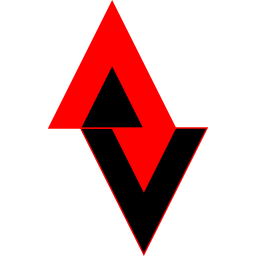

# Alchemic Ventures

Chemistry is the gateway to the future. Social pressure is making it mandatory to abandon oil and petroleum products. Natural resources are being rapidly consumed by a rapid expanding populace. Wood, oil, cotton, meat, and xxx are all going to need alternates if not replaced in the next 50 years. 

That is where Alchemic Ventures will squeeze in. Not a powerfully funded start up but just one mad scientist fighting back in a madder world. 

## Labs
